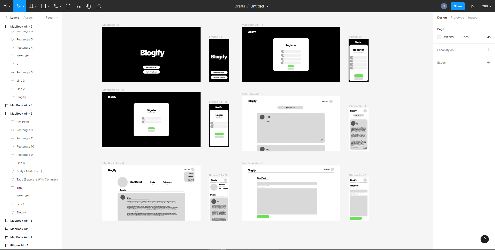
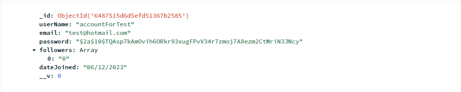

# Blogify 
##📖About
Blogify is an online blogging platform developed using the MERN Stack. Talk about anything and everything easily using the quick and easy posting system, and use the quick and easy tagging system to make them easy to find, or you can follow your favorite accounts and get their posts immediately into a personalized feed. Come check it out <a href="blogifyapp.netlify.app">here</a>

**Test Account Login**: Email: test@hotmail.com Password: testPassword

### ✨ Features
**Front End**
* **Text Based Post System**
* **SASS Styling**
* **Styled-Components**
* **Custom Alert System**
* **Pagination**
* **Protected Routes**
* **React Router and DOM Usage**
* **Material UI Generated Avatars**
* **Customizable Following Feed**
* **Follow System**
* **Post Tagging System**
* **Await/Async Functionality**
* **Completely Mobile Friendly With
  Custom CSS Styling**

**Back End**
* **Custom Error Handeling**
* **Custom User, Post, and Authorization
Mongoose Schemas**
* **Bcrypt Password Encryption**
* **Validator Email Validation**
* **User Registration and Login**


##⚙️Development
###	💅Front end
As a full stack development, alot of technologies went into the entire process, from start to finish. The first step was designing the platform, as I found from previous projects, alot of my time was wasted as I tried to design while I developed. For this I used **Figma**.

**Preliminary Designs for Desktop and Mobile Devices**:


Once I had the design planned out, the front end was pretty simple to flesh-out,. My entire application would be built off of ReactJS, for that I used **SASS** and the **Styled-Components** library to keep things neat and tidy. Once the front end reflected the design accurately, I started to work on the backend portion.

### 👨‍💻Backend
Since I based my project off of the MERN stack, I used **MongoDB** as my main database, **ExpressJS** as a lightweight server-side framework, and **NodeJS** as a general JavaScript runtime to perform and test my application. Using the **Mongoose** library, I developed a custom User schema that would integrate easily with my **ExpressJS** functions. To pass the information back and forth, I used **ExpressJS** to develop a RESTful API that could properly handle the requests and responses needed to run my application.

**💁‍♂️Server**
````
import express from "express";
const app = express();
import dotenv from "dotenv";
dotenv.config("");
import connectDB from "./db/connect.js";

import notFoundMiddleWare from "./middleware/not-found.js";
import errorHandlerMiddleware from "./middleware/error-handler.js";

import authRouter from "./routers/authRouter.js";
import userRouter from "./routers/userRouter.js";
import postRouter from "./routers/postRouter.js";

app.use(express.json());

//middleware
app.get("/", (req, res) => {
  res.send("Welcome");
});


app.use("/api/v1/auth", authRouter);
app.use("/api/v1/user", userRouter);
app.use("/api/v1/post", postRouter);
app.use(notFoundMiddleWare);
app.use(errorHandlerMiddleware);
const port = process.env.PORT || 5000;

const start = async () => {
  try {
    await connectDB(process.env.MONGO_URL);
    app.listen(port, () => {
      `Server is listening at Port : ${port}`;
    });
  } catch (error) {
    error;
  }
};

start();

````
**⛌Auth Router**
````
import express from 'express'
const router = express.Router()

import { register } from "../controllers/authController.js";

router.route('/register').post(register)

export default router

````
**🔒Auth Controller**
````
const register = async (req, res, next) => {
  try {
    const { email, userName, password } = req.body;
    if (!email || !userName || !password) {
      throw new BadRequestError("Please Provide All Values");
    }
    const alreadyUser = await User.findOne({ email });
    if (alreadyUser) {
      throw new BadRequestError("Email Already Used");
    }
    const user = await User.create(req.body);
    res.json({
      user: {
        email: user.email,
        userName: user.userName,
        dateJoined: user.dateJoined,
        followers: user.followers,
        _id: user._id,
        __v: user.__v,
      },
    });
  } catch (error) {
    next(error);
  }
};
````
After the neccessary data is processed from the front-end to server-side, it would be preprocessed by the 
**User Schema**
````import mongoose from "mongoose";
import validator from "validator";
import bcrypt from "bcryptjs";

var today = new Date();
var dd = String(today.getDate()).padStart(2, "0");
var mm = String(today.getMonth() + 1).padStart(2, "0"); //January is 0!
var yyyy = today.getFullYear();

today = mm + "/" + dd + "/" + yyyy;

const UserSchema = new mongoose.Schema({
  userName: {
    type: String,
    required: [true, "Please Provide Name"],
    minlength: 3,
    maxlength: 20,
    trim: true,
    unique: true,
  },
  email: {
    type: String,
    required: [true, "Please Provide Email"],
    unique: true,
    validate: {
      validator: validator.isEmail,
      message: " Please Provide A Valid Email",
    },
  },
  password: {
    type: String,
    required: [true, "Please Provide Password"],
    unique: true,
    minlength: 4,
  },
  dateJoined: {
    type: String,
  },
  followers: {
    type: [String],
    default: [],
  },
});
UserSchema.pre("save", async function () {
  // (this.modifiedPaths())
  if (!this.isModified("password")) return;
  const salt = await bcrypt.genSalt(10);
  this.password = await bcrypt.hash(this.password, salt);
  this.dateJoined = today;
  this.followers = 0;
});
UserSchema.methods.comparePassword = function (candidatePassword) {
  const isMatch = bcrypt.compare(candidatePassword, this.password);
  return isMatch;
};

export default mongoose.model("User", UserSchema);
````

Upon a new user registration, the information that the client has provided would be preprocessed by this schema, such as validating their registration email and encrypting their password using the **Validator** and **Bcrypt** libraries respectively. For some extra fun I also saved the date they joined the site as something to brag about later when this gets really popular

**User Schema Example**


After the user information is saved, the server spits it back out as a response, then I can do what ever I want with it in the front end. Basically, the same process was repeated for Posts and the individual `User` themselves. With some JavaScript magic, I was able to handle very specific requests from the server. For instance, I had a helluva time tryning to figure out how I would retrieve `Posts` based on the users followings (Not to be confused with followers), so I whipped up something like this


**Getting Following Posts**
````
const getFollowingPost = async (req, res, next) => {
  try {
    const { userName } = req.body;
    const allUsers = await User.find({ followers: { $in: [userName] } }).select('_id');
    const userIds = allUsers.map(user => user._id);
    const allPosts = await Post.find({ userId: { $in: userIds } });
    res.send(allPosts);
  } catch (error) {
    next(error);
  }
};
````
While it doesnt really look that complicated, it took a minute to figure out, even as a simple solution. You probably noticed that I used a `next` function in my `try/catch` statement, and that was intentional. As for the serverside, I used John-Smilga's custom error handler, that would be able to properly respond to specific errors and output them accordingly. Since I was able to specify the types of errors, it made debugging a lot easier. 
**Error Handler**
````
const errorHandlerMiddleware = (err, req, res, next) => {
  
  err;
  const defaultError = {
    statusCode: err.statusCode || 500,
    msg: err.message || "Something Went Wrong, Try Again Later",
  };
  if (err.name === "ValidationError") {
    defaultError.statusCode = 400;
    defaultError.msg = Object.values(err.errors)
      .map((item) => item.message)
      .join(", ");
  }
  if (err.code && err.code === 11000) {
    defaultError.statusCode = 400;
    defaultError.msg = `${Object.keys(err.keyValue)} is not unique`;
  }
  res.status(defaultError.statusCode).json({ msg: defaultError.msg });
};

export default errorHandlerMiddleware;
````

By the way alot of this I did after I hooked it up to the front end side of the application, I used **Proxy-Middle-Ware** to set up a client to server proxy, because for some reason a normal proxy in the `package.json` wasn't working. To handle the actual requests and responses, I used the **Axios** library to fetch data and display it on the front-end. This whole process, of getting user information, preprocessing it with **Mongoose**, uploading it to my **MongoDB** database and retriving it using **Axios** was repeated for (like I said before) for both `User` and `Post` handling. 

This `README.MD` is short explanation of how I set up my application, in both front end and backend, ill include a full list of stuff at the end if you're interested. Blogify is going to be hosted on Netlify, with the backend being hosted on Heroku. If you find any bugs, find my project interesting, or want to hire me, you can either email me at hetyug04@gmail.com or check out my other projects <a href="hpatel.netlify.app" target="_blank">here</a>

# blogify

